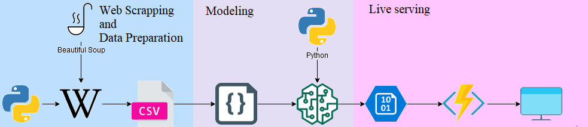

## PROJEKT
### LINGARO x Bany Maciej x Krupińska Izabela
### Serverless real-time document similarity engine using Python and Azure Functions
### Cel projektu
Celem projektu było stworzenie silnika wyszukującego podobne artykuły z Wikipedii do zadanego tytułu lub adresu url bazowego dokumentu Wikipedii.
Projekt zakładał przetestowanie i wdrożenie komponentów Azure, głównie Azure Functions i Azure Blob Storage.

### Rozwiązanie i funkcjonalności
Rozwiązanie zostało oparte na chmurze Azure i wykorzystuje serwisy Azure Table Storage, Azure Blob Storage, Azure Functions.

Silnik został obudowany w statycznej stronie web, która jest hostowana za pomocą Azure Blob Storage.

Ze stworzonej wyszukiwarki można korzystać podając tytuł bądź adres url. Podane dane są przesyłane do Azure Function, w której scrapowany jest pierwszy akapit treści (nagłówek) danego artykułu. Następnie treść jest oczyszczana oraz przekazywana do pobieranych z Blob Storage Modeli (doc2vec oraz logistic regression). Na tej podstawie określana jest kategoria artykułu i zwracany podobny wynik. Dane wyświetlane są w tabeli z nazwami tytułów jako linki do WIkipedii oraz pierwszymi 100 znakami nagłówka artykułu.

### Diagram architektury
Poniżej znajduje się diagram architektury projektu. Dane są pobierane z Wikipedii, przygotowywane do modelu, następnie odbywa się trening sieci. Model zostaje zapisany w Azure Blob Storage. Ostateczny wynik uzysuje się w przygotowanej przeglądarce Wikipedia Similarity Engine. Wpisane zadanie trafia do Azure Function, z której dostajemy wynik końcowy.
 

Przepływ projektu można podzielić na trzy główne części:
* web scrapping i przygotowanie danych,
* stworzenie modelu,.
* dostarczenie usługi
jak pokazano na poniższym diagramie.
 

#### Web Scrapping and Data Preparation
Used:
* ConfigParser
* nltk
* asyncio
* threading
* BeautifulSoup
* pandas
* requests
* typing

Dane zostały pobrane z Wikipedii przy pomocy analizy dokumentów HTML poprzez Beautiful Soup. Wyznaczylismy zbiór 5 kategorii: Animals, Sports, Instruments, Painters, Countries. Do każdej kategorii dodaliśmy po 15 tytułów. Był równy rozkład danych.

Pobrane dane zostały odpowiednio przygotowane. Litery zmniejszono i usunięto niealfabetyczne znaki.

Nieoczyszczone dane, oraz te oczyszczone wraz z ich kategoriami i nazwami zapisano w kolumnach jako plik csv i przesłano do Azure Storage.

#### Modeling
Used:
* pandas, numpy, tqdm, sklearn, re, seaborn, nltk, pickle
* gensim

Do trenowania modelu zostały użyte oczyszczone dane z naszej kolumny CleanWiki. Zredukowaliśmy sekwencję tokenów w analizie leksykalnej używając NLTK tokenizer. Usunęliśmy słowa krótsze niż 2 litery. 

Następnie usuneliśmy stopwords, czyli słowa które nie niosą znaczenia. 

Za pomoca Tagged Document z gensim nadaliśmy tagi(kategorie) kolejnym dokumentom. Przeprowadziliśmy badania dzieląc otagowane dokument na zbiór trenujący i testowy.

Stworzyliśmy kilka modeli doc2vec z rozproszonym zbiorem słów (dm =0) lub 'rozproszoną pamięcią' (dm=1). Zmienialiśmy wymiarowość wektora cech, liczbę ignorowanych słów, ilość słów szumów. Najlepszy okazał się model z rozproszonym zbiorem słów o rozmiarze wektora 300 i wartością alpha 0.065.
Dokładność zbioru treningowego wynosiłą 100%, a testowego 95.7%. Miara F1 dla zbioru treningowego = 100%, a dla tetsowego 95.7%

Na podstawie otrzymanego modelu doc2vec został zbudowany model regresji logistycznej.

#### Live serving
Została stworzona funkcja, która pobierała nauczone modele z Blob Storage, generowałą prawdopodobieństwo kategorii dla danej frazy, wpisanej przez użytkownika w wyszukiwarce. Funkcja zwracała inne artykuły pasujące do wpisanej frazy

### Instrukcja reprodukcji rozwiązania
1. Pobrać nasz github
2. pip3 install -r requirements.txt
3. Uzupełnić connection string w config.ini
3. Uruchomić start.py
4. Tam zapisze się plik z przetworzonymi danymi result.csv
5. Uruchomić plik bestmodel.ipynb
6. Modele dodać do Blob Storage
7. Uruchomić pliki z folderów website i functions.

### Ngranie video 
Po tym linkiem można znaleźć prezentację naszego projektu: https://youtu.be/5TFOnCP0Y_E.

Link do rozwiązania: https://asdsstorageaccount.z6.web.core.windows.net/.

