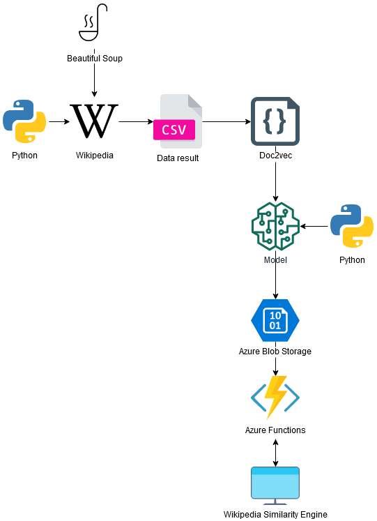
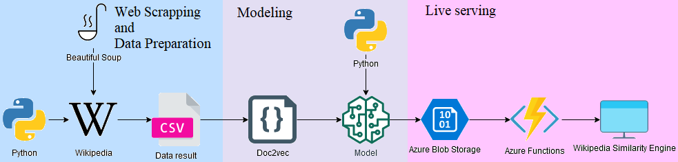

## PROJEKT
### LINGARO x Bany Maciej x Krupińska Izabela
### Serverless real-time document similarity engine using Python and Azure Functions
 
 
### Plan
1. Funkcjonalny serwis, rekomendujący artykuły Wikipedii w oparciu o ich podobieństwo do zadanego wyszukiwania.
2. Wektorowa reprezentacja dokumentów zrealizowana przy użyciu języka Python.
3. Wdrożenie oparte o Azure Functions i Azure Storage.

### Zadana realizacja projektu 
1. Dane uzyskane metodą scrapingu z Wikipedii. (Ewentualnie - skorzystanie z dumpa Wikipedii?).
2. Przetworzenie danych (oczyszczenie, wekrtoryzacja).
3. Przygotowanie środowiska do treningu modeli uczenia maszynowego oraz środowisko wdrożeniowe (python3, anaconda, gensim).
4. Wytrenowanie modeli oraz realizacja ich wdrożenia (Model: LDA/LSA, Azure Functions, Azure Blob Storage).

### Spotkania 
1. 03.12.2020r. 13:30
* Przedstawienie pomysłu na projekt.
* Sprawy organizacyjne.
* Ocena zespołu.

2. 17.12.2020r. Check-point

3. 15.01.2021r. Check-point

4. Oddanie projektu
